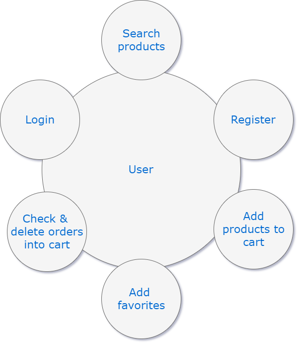
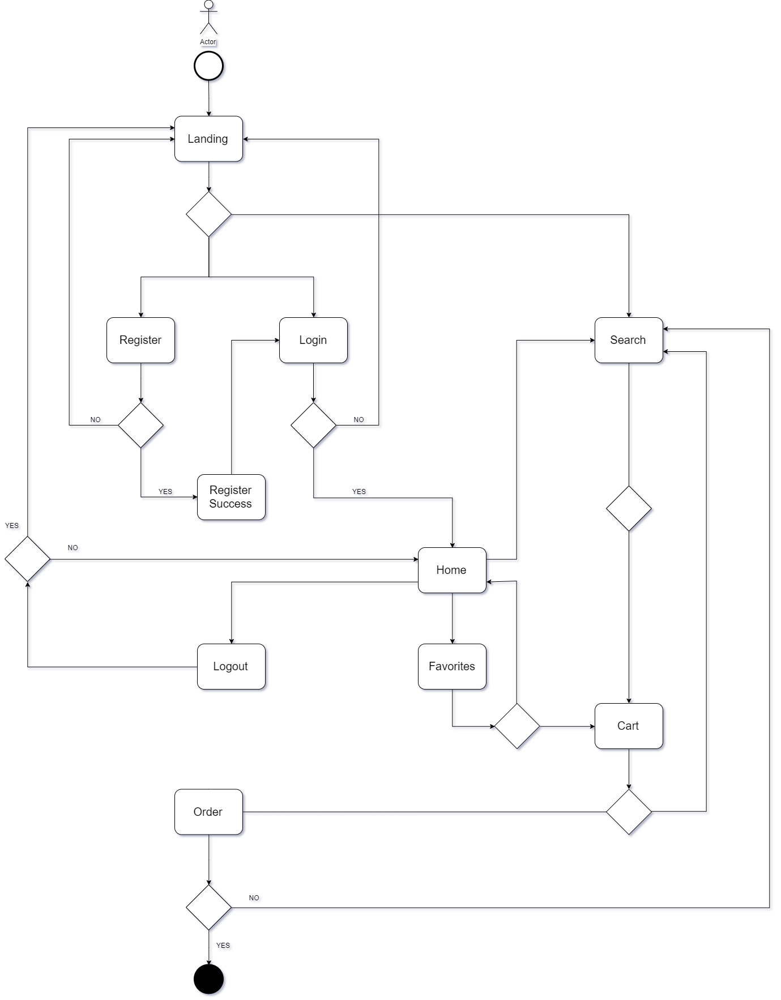
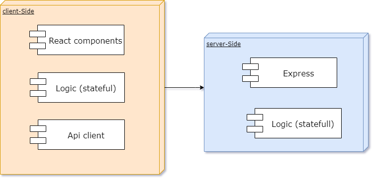

# Eco-Logic

***Don't stop trying***

## [Eco-Logic Trello](https://trello.com/b/bfwDrnGU/eco-logic)

## Introduction
This App pretends to simulate the operation of an e-commerce of responsible and sustainable product consumption.

Any user can search products, both by category and by the general search engine. 
You can access to the product listed by a click to see the detail of the product and finally you could add any product you wish to buy into the cart. Into the cart you are able to see all the orders, check the data order and delete an order.

A registered user can access into their private and personalized area. As a registered user you can do the same operations cited above & can select products as favorites.

## Functional description
![ToDo] wireframes

Any user can:
* Search products by categories or by search toolbar.
* Register to the comunity.
* Login to their home page.
* Add products & quantity of them to the cart.
* Check & delete orders into the cart.

Registered user can:
* Add products to favorites.

### Use cases

### Flowcharts
#### User

## Technical description
### Block diagram

### Components

### React components

### Data model

### Code coverage

### Technologies
JavaScript, ReactJS, Node.js, Express, MongoDB, Mongoose, SASS.
Testing: Jest & Mocha-Chai.
Others: draw.io

## ToDo
* Create a comunity (forum)
* Create an admin userCase